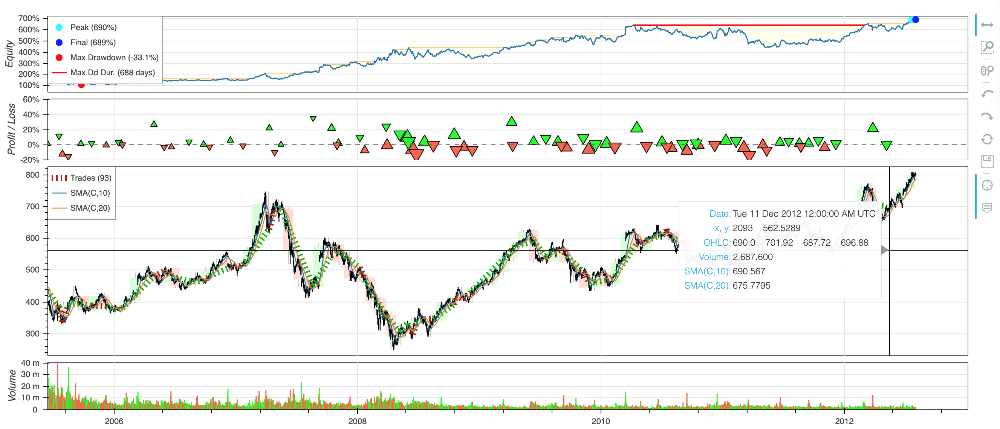

</br>


<!-- buttons -->
<p align="center">
    <a href="https://www.python.org">
        </a> &nbsp;
    <a href="https://www.python.org">
        </a> &nbsp;
</p>

</br>

# ``QRDE-SAT`` - Quant Research & Development Environment for Systematic Asset Trading

QRDE-SAT houses my personal Python library for Financial Quantitative Research & Development of Trading Strategies.

``QRD-SAT`` provides modular components for data extraction, research, modeling, strategy creation, backtesting, and deployment.

</br>

## Table of Contents

1) [Installation](#1-installation)
2) [Quant-RDE-SAT Features](#3-features)
    - 2.1) [Data Sourcing API](#21-data-sourcing-api)
    - 2.2) [Research Module](#22-research-module)
    - 2.3) [Quantitative Models Module](#23-quantitative-models-module)
    - 2.4) [Strategies Module](#24-strategies-module)
    - 2.5) [Backtesting Module](#25-backtesting-module)
    - 2.6) [Deployment Module](#26-deployment-module)
3) [Future Works](#3-future-works)
4) [Source Libraries](#4-source-libraries)


</br>

## 1) Installation
To install ``QRDE-SAT``, you can try one of the following options:

#### 1. Installation for Users (via pip)
 
Install ``QRDE-SAT`` package to your project virtual environment. To do this simply: 

1. Open your project
2. Go to the terminal and run the following (within your virtual environment of choice):

    ```bash
    pip install -e git+https://github.com/alvarosf07/Quant-RDE-SAT.git
    ```

 #### 2. Installation for Developers
 Download ``QRSDE-SAT`` in order to work with the source code.

1. Clone the repository:
    ```bash
    git clone https://github.com/alvarosf07/Quant-RDE-SAT
    ```
2. Navigate to the main directory of the repository: 
    ```bash
    cd ../../Quant-RDE-SAT
    ```
3. Install required dependencies (within your local environment):
    ```bash
    pip install -r requirements.txt
    ```


</br>


# 2) ``QRDE-SAT`` Features
## 2.1) Data Sourcing API
- **Purpose**: Seamlessly extract diverse financial data from multiple APIs.
- **Key Capabilities**:
  - Support for equities, fixed income, commodities, forex, and crypto data.
  - Integration with popular financial APIs: 
    - Alpha Vantage
    - Interactive Brokers 
    - Yahoo Finance _(TBI)_
  - Customizable data pipelines for preprocessing and storage.

  </br>

## 2.2) Research Module
- **Purpose**: Facilitate quantitative research through robust asset and portfolio definitions.
- **Key Capabilities**:
  - Define and manipulate **asset classes** (e.g., stocks, bonds, derivatives, currencies, commodities, crypto...).
  - Create **portfolio structures** for multi-asset analysis.
  - Enable **research studies** such as risk profiling, factor analysis, and scenario modeling.

  ### Quick Example:
  ```python
    from qrde_sat.qrde1_data import *
    from qrde_sat.qrde2_research import *

    GS = EquityAsset('GS')
    dataGS = GS.get_ohlcv_data(sd="2024-01-01", ed="2024-11-20", frequency_interval="weekly", api_source="AlphaVantageAPI", data_adjusted="false", extended_hours="false")
  ```
  ##### Output:

  > Sourcing data from API:
    --> https://www.alphavantage.co/query?&function=TIME_SERIES_WEEKLY&symbol=MS&outputsize=full&adjusted=false&extended_hours=false&datatype=json&apikey=XXXXXXXX 
    ```
                  Date      Open      High       Low     Close    Volume
        1   2024-11-15  598.9000  607.1500  586.2400  593.5400  10345127
        2   2024-11-08  518.0000  598.6050  510.5100  589.2600  19200378
        3   2024-11-01  515.4000  530.7850  514.5301  519.3500   8098061
        4   2024-10-25  528.0000  529.8500  510.7400  512.6000   8294593
        5   2024-10-18  517.6500  540.5100  515.5100  528.5000  13252133
        6   2024-10-11  494.6300  517.9700  490.7900  516.3000   7884739
        7   2024-10-04  494.8900  496.5150  484.2000  495.1600   7589303
        8   2024-09-27  498.2100  505.4000  490.3950  498.5100   6551043
        9   2024-09-20  481.4300  506.4100  479.4900  498.4300  12158126
        10  2024-09-13  485.5300  494.2800  457.4800  478.9900  11000555
        11  2024-09-06  507.4700  509.7000  477.0600  479.6100   7684736
        12  2024-08-30  512.3400  513.5000  498.4700  510.2500   7035638
        13  2024-08-23  505.0000  512.4400  494.0325  509.4200   6763634
        14  2024-08-16  490.2600  506.9100  483.7500  504.2600   7948548
        15  2024-08-09  447.5900  492.0000  437.3700  490.2600  12533544
        16  2024-08-02  500.4200  517.2600  467.2100  470.6400  17023147
        17  2024-07-26  484.5600  504.0000  482.3808  499.0300   9151221
        18  2024-07-19  480.2500  509.4750  476.3070  484.9300  16811873
        19  2024-07-12  467.6500  483.4400  461.5800  479.8800  13665824
        20  2024-07-05  454.5100  469.8899  454.0100  464.7500   5930205
        ...
        43  2024-01-26  386.3600  392.7300  376.7500  377.7900  14102520
        44  2024-01-19  378.3600  385.0100  372.0700  382.2000  10716399
        45  2024-01-12  385.9700  389.0800  374.6800  377.7500   9592481
        46  2024-01-05  383.0000  389.4700  376.7633  386.4400   9043981
    ```

</br>

## 2.3) Quantitative Models Module
- **Purpose**: Develop and integrate advanced financial models.
- **Key Capabilities**:
  - Implement probabilistic models (e.g., Markov Models, Kalman Filters).
  - Incorporate machine learning techniques (e.g., Neural Networks, Random Forests).
  - Custom model creation for specific quantitative needs.

</br>

## 2.4) Strategies Module
- **Purpose**: Design and simulate various trading strategies.
- **Key Capabilities**:
  - Base Strategy Class that provides the basic structure for any kind of trading strategy to be included.
  - Rule-based strategies (e.g., moving averages, mean-reversion) _(TBI)
  - Advanced algorithmic strategies (e.g., pairs trading, arbitrage) _(TBI)_
  - Custom strategies with user-defined parameters _(TBI)_

</br>

## 2.5) Backtesting Module
- **Purpose**: Evaluate trading strategies using historical data.
- **Key Capabilities**:
  - Event-driven backtesting framework for realistic simulations.
  - **Backtesting Engine** that performs all main backtesting operations. The engine is an abstraction built on top of other existing backtesting libraries such as [Backtesting.py](https://kernc.github.io/backtesting.py/), [Backtrader](https://www.backtrader.com/)...
  - **Backtesting analysis** module that provides: 
    - Metrics for performance analysis (e.g., Sharpe Ratio, Maximum Drawdown).
    - Visual analysis charts
  - **Optimization module** that enables iteration and refinement of strategies.
  - Support for multi-asset and multi-timeframe backtesting.
  
  ### Quick Example:
  Below we use test the implementation of a sample crossing moving average strategy and its backtesting, extracted from backtesting.py:

  ```python
    import backtesting
    import qrde_sat

    from qrde_sat.qrde4_strategies import Strategy
    from qrde_sat.qrde5_backtesting import Backtest
    from backtesting.lib import crossover
    from backtesting.test import SMA, GOOG


    class SmaCross(Strategy):
        n1 = 10
        n2 = 20

        def init(self):
            close = self.data.Close
            self.sma1 = self.I(SMA, close, self.n1)
            self.sma2 = self.I(SMA, close, self.n2)

        def next(self):
            if crossover(self.sma1, self.sma2):
                self.buy()
            elif crossover(self.sma2, self.sma1):
                self.sell()


    bt = Backtest(GOOG, SmaCross,
                cash=10000, commission=.002,
                exclusive_orders=True)

    output = bt.run()
    bt.plot()
  ```
  ##### Output:

    ```
        Start                     2004-08-19 00:00:00
        End                       2013-03-01 00:00:00
        Duration                   3116 days 00:00:00
        Exposure Time [%]                       94.27
        Equity Final [$]                     68935.12
        Equity Peak [$]                      68991.22
        Return [%]                             589.35
        Buy & Hold Return [%]                  703.46
        Return (Ann.) [%]                       25.42
        Volatility (Ann.) [%]                   38.43
        Sharpe Ratio                             0.66
        Sortino Ratio                            1.30
        Calmar Ratio                             0.77
        Max. Drawdown [%]                      -33.08
        Avg. Drawdown [%]                       -5.58
        Max. Drawdown Duration      688 days 00:00:00
        Avg. Drawdown Duration       41 days 00:00:00
        # Trades                                   93
        Win Rate [%]                            53.76
        Best Trade [%]                          57.12
        Worst Trade [%]                        -16.63
        Avg. Trade [%]                           1.96
        Max. Trade Duration         121 days 00:00:00
        Avg. Trade Duration          32 days 00:00:00
        Profit Factor                            2.13
        Expectancy [%]                           6.91
        SQN                                      1.78
        _strategy              SmaCross(n1=10, n2=20)
    ```




</br>

## 2.6) Deployment Module
- **Purpose**: Deploy strategies to real-world brokers for execution.
- **Key Capabilities**:
  - Integration with broker APIs (e.g., Interactive Brokers, Alpaca, Robinhood) _(TBI)_
  - Live trading execution and monitoring _(TBI)_
  - Modular architecture for easy broker API extensions _(TBI)_

</br>

# 3) Future Works
Some of the improvements that may be added in future versions of ``QRDE-SAT`` include the following:
- Develop detailed documentation for models and API usage under ``docs`` folder.
- Finish implementation of all models and functionalities whose status appears as "_(TBD)" (i.e. to be implemented)_ in the summaries described above.
- Include additional quantitative models and use them to develop new personal trading strategies.
- Develop a robust deployment module to trade researched and backtested strategies on live markets.
- Implement tests for all library functionalities under the folder ``tests``.

</br>

# 4) Source Libraries 

- [Backtesting.py](https://kernc.github.io/backtesting.py/)
- [Backtrader](https://www.backtrader.com/)
- [Bt](https://pmorissette.github.io/bt/)
- [finmarketpy](https://github.com/cuemacro/finmarketpy)
- [Zipline](https://zipline.ml4trading.io/)
- [PyAlgoTrade](https://github.com/gbeced/pyalgotrade)
- [FastQuant](https://github.com/enzoampil/fastquant)

</br>
